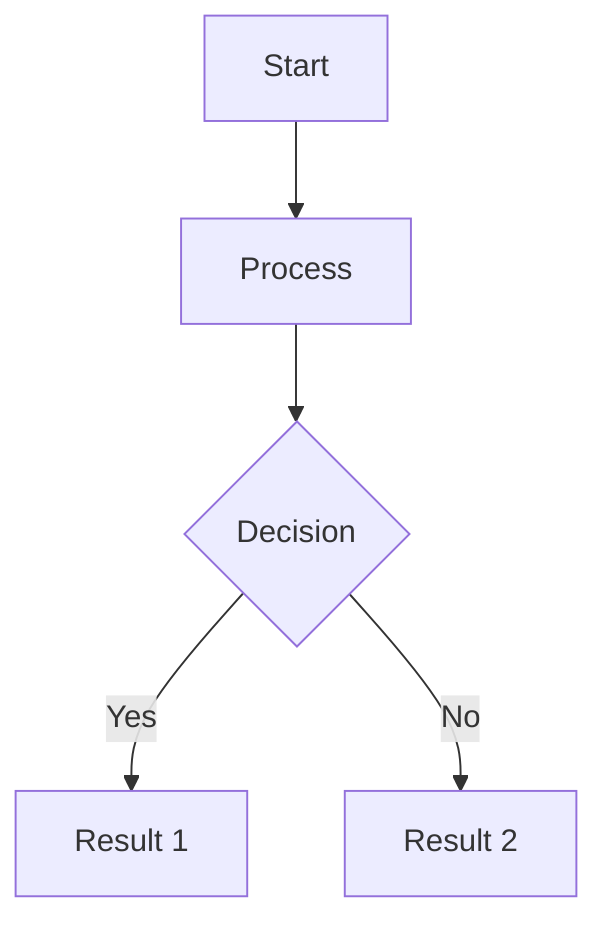
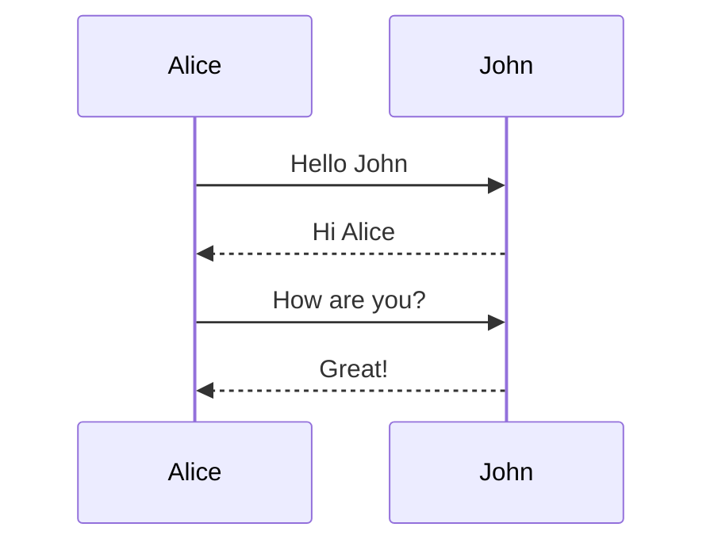
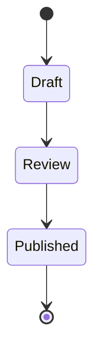
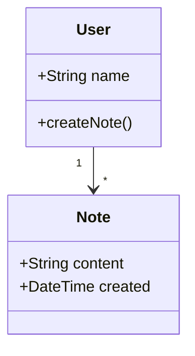
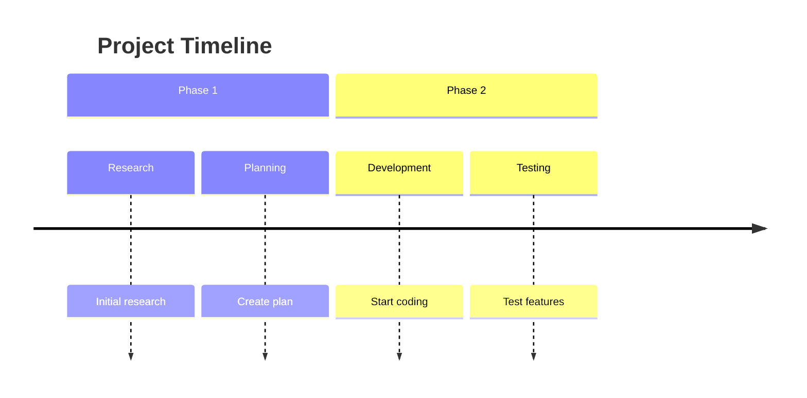
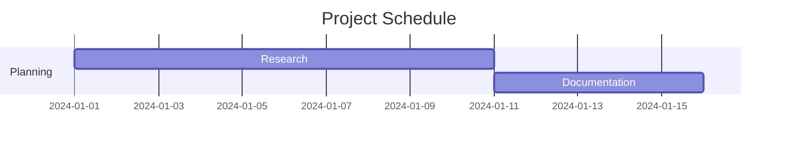

# Mermaid Diagram Examples

Flowchart:

```mermaid
graph TD
    A[Start] --> B[Process]
    B --> C{Decision}
    C -->|Yes| D[Result 1]
    C -->|No| E[Result 2]
```

Sequence diagram:

```mermaid
sequenceDiagram
    Alice->>John: Hello John
    John-->>Alice: Hi Alice
    Alice->>John: How are you?
    John-->>Alice: Great!
```

State diagram:

```mermaid
stateDiagram-v2
    [*] --> Draft
    Draft --> Review
    Review --> Published
    Published --> [*]
```

Class diagram:

```mermaid
classDiagram
    User "1" --> "*" Note
    class User{
        +String name
        +createNote()
    }
    class Note{
        +String content
        +DateTime created
    }
```

Timeline:

```mermaid
timeline
    title Project Timeline
    section Phase 1
        Research : Initial research
        Planning : Create plan
    section Phase 2
        Development : Start coding
        Testing : Test features
```

Gantt chart:

```mermaid
gantt
    title Project Schedule
    dateFormat  YYYY-MM-DD
    section Planning
    Research           :2024-01-01, 10d
    Documentation     :2024-01-11, 5d
```
