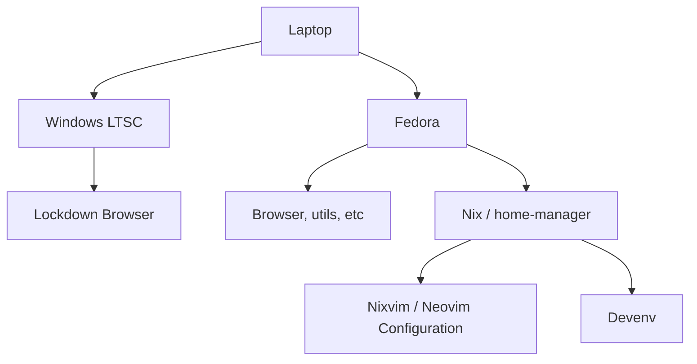

# Optimal Learning for Undergrad-level Computer Science 

I am currently attending NJIT as a fourth-year undergrad CS student. These have been my experiences as a student:

## The Necessity of Windows

Windows is an unfortunate fact-of-life at NJIT: most classes mandate the use of the [Respondus Lockdown Browser](https://web.respondus.com/he/lockdownbrowser/),
and some require that you install it on your *personal laptop(!)* for assignments as small as quizzes. This software is only available for Windows and macOS as of the time I'm writing this (2024-11-30).

This alone carries a non-negligible [security risk](https://www.cwu.edu/academics/academic-resources/multimodal-learning/_documents/lockdown-browser-sa.pdf), but the alternative offered to students is to simply accept zeroes on all exams / assignments which require Lockdown Browser (which, mind you, often comprise more than 15% of our grade each). Simply refusing to use Lockdown Browser is not an option.

The other alternative, trying to sandbox Lockdown Browser in a VM and / or Wine under Linux, carries the potential for virtualization detection and automatic failing of the course as a whole and potential expulsion from the university. This alternative, while theoretically possible, is categorically too risky for consideration.

This creates a need to run both modern Windows (10/11 at time of writing) and Lockdown Browser on bare metal.

`NOTE: Everything below here is incomplete.`

## The Need for an Open Development Ecosystem

### The Hidden Fragilities of macOS

Pros:

- Comfortable UI
- Lockdown Browser compatibility
- iOS App Development Optionality
- Industry standard for a reason

Cons:

- Lack of control AND practical optionality over your desktop environment
- Changing development requirements (all desktop apps need to be signed, etc)
- Lack of true ownership over hardware and development experience
- Suboptimal high cost of hardware (even with education discount) for university years

### Linux as Hormesis

Linux provides the following:

- Difficult installation on certain distros
- Semi-frequent debugging of environment and applications
- Inconsistent support of hardware
- Steep initial learning-curve

However, what seems like a disadvantage and a headache turns into a major advantage you'll have going into the job market:

- Experience with:
    - a Unix-like command-line (coreutils, compilers, build tools, etc)
    - Solving non-obvious configuration issues
    - Editors and tooling which are available ***everywhere*** ((neo)vim, emacs, etc.)
- Deep intuition for how Unix-like systems work at a fundamental level
- Knowledge of how software interacts with the most common server operating systems

When used alone, you're almost certain to crash and burn. However, when you use Linux with a backup OS, you maintain the upside of learning
Linux while eliminating the downside that would be having an unusable system.

## The Optimal Development Barbell: Windows LTSC, Fedora Linux, Nix & home-manager

Here's a high-level overview of what an ideal system would look like:

## References

- [Respondus Lockdown Browser](https://web.respondus.com/he/lockdownbrowser/)
- [Central Washington University - Lockdown Browser Security Risk Assessment](https://www.cwu.edu/academics/academic-resources/multimodal-learning/_documents/lockdown-browser-sa.pdf)

